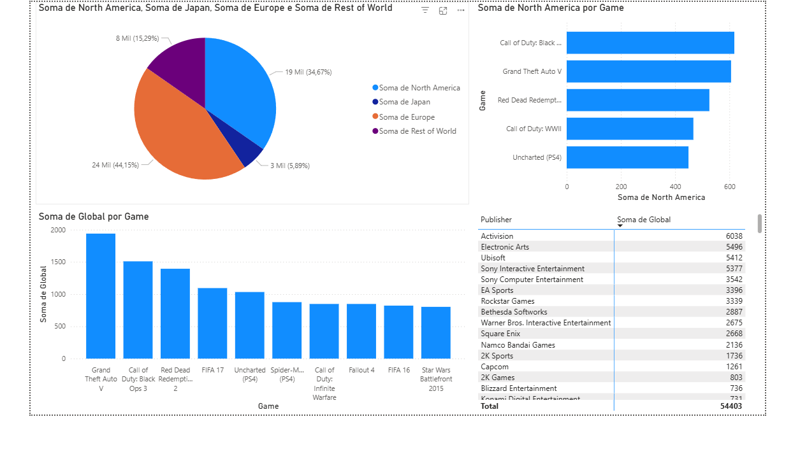
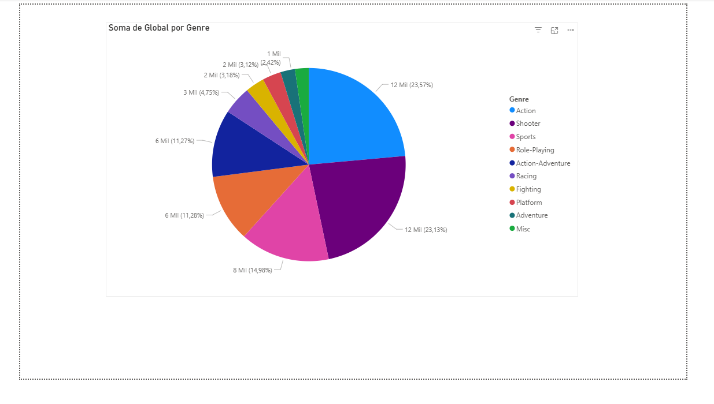

# Minha Jornada em Power BI 🎮📊

Bem-vindo ao meu repositório! Aqui compartilho meus **primeiros relatórios em Power BI**, desenvolvidos a partir do dataset [Video Games Sales Dataset](https://www.kaggle.com/datasets) do Kaggle.

---

## 🔍 Sobre os relatórios

Meus relatórios exploram as vendas de jogos e respondem perguntas estratégicas sobre o mercado de games:

1. **Quem comprou mais por região** 🌎  
     

2. **Top 10 jogos mais vendidos globalmente** 🏆  
     

3. **Qual jogo mais vendeu na América do Norte** 🇺🇸  
     

4. **Publisher que mais vendeu globalmente** 🏢  
     

5. **Tipos de jogos mais populares na Europa** 🎯  
     

> Cada imagem/GIF acima mostra como transformei dados brutos em **insights claros e visuais** com Power BI.

---

## 🛠 Tecnologias utilizadas

- **Power BI**: Para análise e visualização de dados  
- **Kaggle**: Fonte do dataset  

---

## 🚀 Próximos passos

- Explorar análises mais avançadas com **filtros interativos**  
- Criar dashboards combinando múltiplos datasets  
- Compartilhar melhores práticas e aprendizados sobre Power BI  

---

## 📂 Estrutura do repositório

